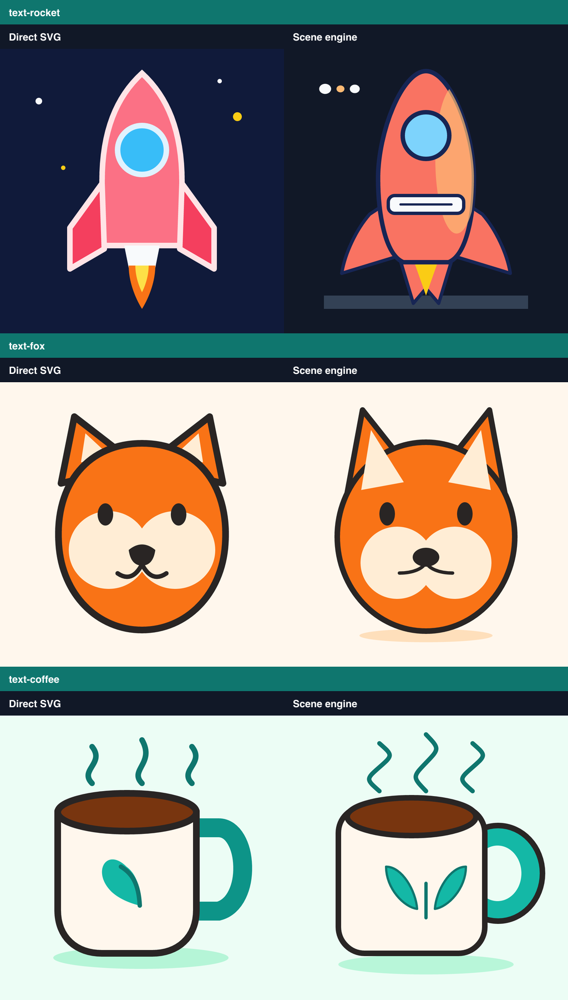

# Draw Vector Art

`draw-vector-art` is a Codex plugin and deterministic TypeScript drawing engine for clean, editable SVG icons and simple illustrations. Codex authors a constrained semantic scene, validates it, renders previews, inspects the result, and revises named parts instead of guessing raw SVG coordinates in one pass.



## Use it in Codex

This repository is also a local Codex marketplace. After cloning it, install the plugin with:

```bash
codex plugin marketplace add /absolute/path/to/draw-vector-art
codex plugin add draw-vector-art@personal
```

Start a new Codex task, then ask naturally or invoke the skill explicitly:

```text
Use $draw-vector-art to make a golf ball on a tee.
```

Codex delivers the editable scene JSON, clean SVG, 1024 px preview, and validation report. Reference adaptations also include a comparison sheet.

## Engine commands

Run from the repository root:

```bash
npm --prefix plugins/draw-vector-art/skills/draw-vector-art install
npm --prefix plugins/draw-vector-art/skills/draw-vector-art run draw -- schema
npm --prefix plugins/draw-vector-art/skills/draw-vector-art run draw -- validate /path/to/scene.json
npm --prefix plugins/draw-vector-art/skills/draw-vector-art run draw -- render /path/to/scene.json --out /path/to/output
```

## Reproduce the comparison pilot

The repository includes a 12-task evaluation manifest and a three-task smoke-test run. The pilot compares a one-shot direct SVG against a validated scene-engine result and generates deterministic blind A/B sheets plus a blank human scorecard:

```bash
npm --prefix plugins/draw-vector-art/skills/draw-vector-art run benchmark -- \
  tests/evaluation/pilot/run.json \
  --out ../../../../benchmark-results/pilot
```

The included pilot is illustrative, not an independent model evaluation. A defensible product claim requires independently generated outputs for all 12 tasks and blinded human scoring. The runner deliberately reports structural metrics without pretending they measure visual quality.

## Verify

```bash
npm --prefix plugins/draw-vector-art/skills/draw-vector-art run check
```
